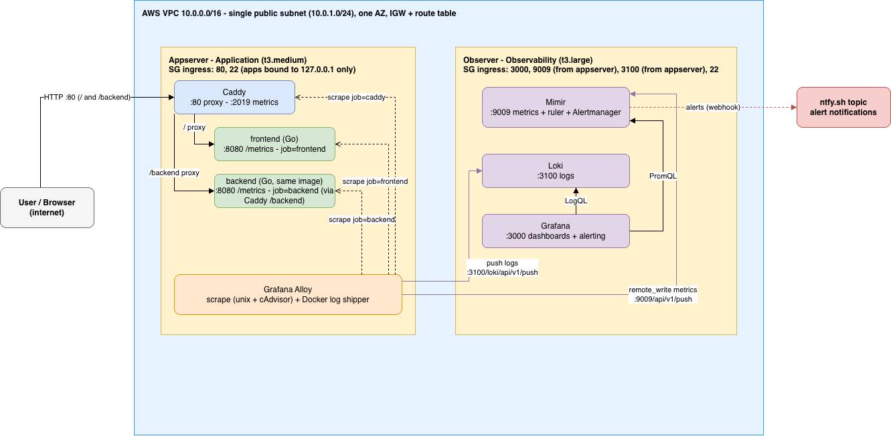
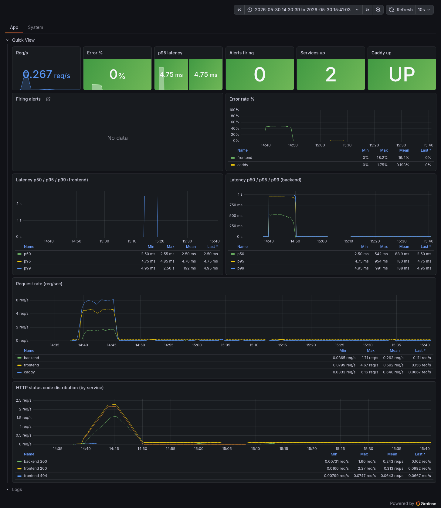
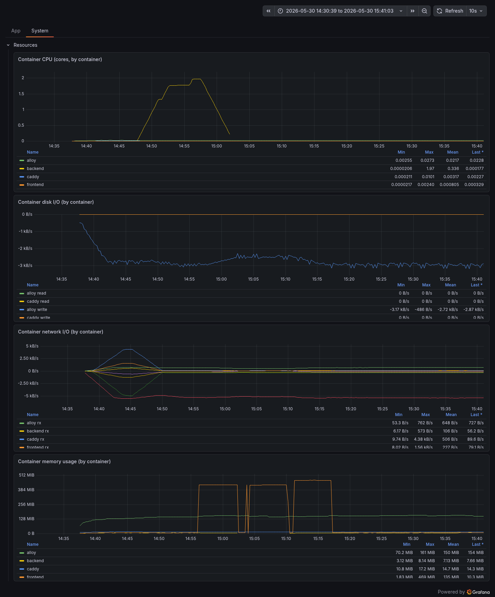
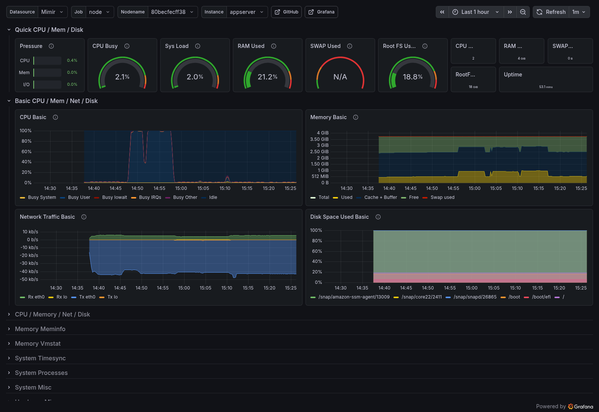

# project Observability

Two-server observability stack on AWS. OpenTofu provisions the infrastructure,
Ansible deploys two Docker Compose stacks. Appserver runs two Go services from
the same image: a frontend and a backend, both behind Caddy on :80 (`/` to the
frontend, `/backend` to the backend), with a Grafana Alloy agent scraping both.
The app containers bind only to host loopback, Caddy is the public entrypoint.
Observer runs the observability stack: Mimir for metrics, Loki for logs, Grafana
for dashboards and alerting.

Everything is in the repo. Dashboards, datasources, and alert rules are
provisioned on boot, nothing is clicked in by hand. The only thing baked into an
image is the Go binary.

## Architecture



Source diagram and flow notes: [docs/architecture/diagram.md](docs/architecture/diagram.md)
(editable source: `docs/architecture/infra.drawio`).

## Prerequisites

- OpenTofu >= 1.6 (phase01, infrastructure).
- Ansible, ansible-core >= 2.15 (phase02, deployment). `requirements.yml` pulls
  in the community.docker and cloud.terraform collections.
- AWS credentials with rights to create a VPC, EC2 instances, security groups,
  and a key pair.
- An SSH client. You don't need Docker locally (it runs on the instances), only
  if you want to rebuild the app image from `app/` with `app/build-and-publish.sh`.
- pre-commit (optional but recommended). Run `pre-commit install` once after
  cloning so the dashboard hook runs on commit (see "Editing dashboards").

Phase 01 builds the two EC2 instances. Phase 02 deploys the stacks onto them.

## Quick start

```bash
# 1. Provision infrastructure (phase01)
cd phase01
tofu init
tofu apply        # review the plan, then approve
cd ..

# 2. Install collections and run the playbook
cd phase02/ansible
ansible-galaxy collection install -r requirements.yml
ansible-playbook site.yml
```

Apply phase01 first: observer comes up before appserver so Mimir and Loki are
listening when Alloy starts pushing. There is no inventory to edit, `inventory.yml`
defines two hosts whose addresses (and appserver's `OBSERVER_IP`) come from the
phase01 outputs at runtime via the `cloud.terraform.tf_output` lookup. The
playbook copies `phase02/observer` (plus `alerts/`) and `phase02/appserver` to
the hosts, renders appserver's `.env`, and runs `docker compose up` on each.

### Verify

Set `APP` and `OBS` to the public IPs (from the deploy summary or
`tofu -chdir=phase01 output`):

```bash
APP=$(tofu -chdir=phase01 output -raw appserver_public_ip)
OBS=$(tofu -chdir=phase01 output -raw observer_public_ip)

# Frontend through Caddy (:80)
curl http://$APP/                # {"service":"...","message":"ok"}
curl http://$APP/caddy-health    # OK (answered by Caddy directly)

# Backend through Caddy under /backend, same image, separate service
curl http://$APP/backend/        # {"service":"...","message":"ok"}

# Grafana
open http://$OBS:3000            # login admin / admin
```

Grafana opens on the Application Performance dashboard, which breaks the two
services out by `job` (frontend and backend) across the request-rate, error,
latency, status, and log panels. Two dashboards ship in the project folder,
Application Performance and Node Exporter Full, and fill in within ~30s once the
services see traffic. To generate some on both:

```bash
for i in $(seq 1 200); do curl -s http://$APP/slow >/dev/null; curl -s http://$APP/backend/slow >/dev/null; done
```

The Application Performance dashboard has two tabs. **App** shows the RED
metrics, per-service error rate, frontend/backend latency, request rate, and
status codes:



**System** shows per-container resource usage (CPU, memory, network, disk):



The Node Exporter Full dashboard covers appserver's host-level system health:



The App tab is also shown with alerts firing in
[docs/alerts-screenshots.md](docs/alerts-screenshots.md).

## Triggering alerts

Alerts post to the ntfy topic `alekc-project-observability-demo`. Subscribe in
the ntfy app or open https://ntfy.sh/alekc-project-observability-demo to watch
them fire. The receiver is set in
`phase02/observer/mimir/alertmanager-fallback.yaml`; change it and re-run
`ansible-playbook -i phase02/ansible/inventory.yml phase02/ansible/site.yml` to
push a new config.

All five can be driven from the services' HTTP surface, no SSH needed. `/cpu`
and `/mem` are bounded load endpoints (capped duration and allocation) added for
exactly this. The commands below hit the frontend via Caddy on :80; target the
backend the same way under `/backend` (e.g. `curl http://$APP/backend/error`).

| Alert                | How to trigger                                                                                                  |
|----------------------|-----------------------------------------------------------------------------------------------------------------|
| **AppDown**          | `ssh ... "cd ~/project-observability/phase02/appserver && docker compose stop backend"` (fires after 1m)          |
| **HighErrorRate**    | `while true; do curl -s http://$APP/error >/dev/null; done` (per service, fires after ~90s)                      |
| **SlowResponseTime** | `while true; do curl -s http://$APP/slow >/dev/null; done` (per service, p95 lands ~0.95s, fires after ~3m)      |
| **HighCPUUsage**     | `curl "http://$APP/cpu?seconds=200"` (per container, fires after ~2m when a container holds >0.8 cores)          |
| **HighMemoryUsage**  | `curl "http://$APP/mem?mb=460&seconds=200"` (holds ~460MB, ~90% of the 512m limit, fires after ~2m)             |

Every alert names the container responsible. HighErrorRate and SlowResponseTime
are per service (`job=frontend` / `job=backend`); AppDown names the down job
(caddy, frontend, or backend); HighMemoryUsage and HighCPUUsage are cAdvisor
container-scoped and name the container (so loading the backend's `/mem` or
`/cpu` fires for the `backend` container specifically).

Watch alerts in Grafana under Alerting, which queries Mimir's ruler and embedded
Alertmanager server-side. Mimir's own port (9009) is open only to appserver, so
`http://$OBS:9009/...` won't load from your laptop; to hit it directly, SSH to
observer and `curl localhost:9009` (e.g. `/alertmanager`,
`/prometheus/api/v1/rules`). Firing alerts also post to the ntfy topic above.

Screenshots of each alert firing, in Grafana and as the ntfy notification, are
in [docs/alerts-screenshots.md](docs/alerts-screenshots.md).

### A note on detection latency

These alerts are deliberately slow to fire. Three things stack up: Alloy scrapes
every 15s, the rules average over a `rate(...[5m])` window, and each rule has a
`for` hold (90s to 5m). So after errors start, the 5m window has to fill enough
for the ratio to cross the threshold, then the `for` must elapse, HighErrorRate
realistically fires 2 to 4 minutes in, not at 90s. That trade favours stability
(few false positives) over speed, which is fine for a demo but slow for
production.

To detect faster in production:

- **Shorter rate window** (`[1m]`/`[2m]`) and/or **shorter scrape interval**
  (5 to 10s): quicker reaction, at the cost of noisier signals and more samples.
- **Multi-window, multi-burn-rate alerts** (the SRE workbook pattern): a
  fast-burn rule on a short window catches sharp spikes in seconds-to-a-minute,
  while a slow-burn rule on a long window catches slow erosion, without the
  false positives of a single short window. This is the recommended approach.
- **Recording rules** to precompute the burn-rate expressions, so evaluation
  stays cheap as the rule set and cardinality grow.
- **Tighter Alertmanager grouping** (`group_wait`/`group_interval`): the current
  30s `group_wait` adds delay before the first notification goes out.

## Editing dashboards

Dashboards are provisioned from disk and reload automatically (the provider
polls every 30s), so the source of truth is the JSON in
`phase02/observer/grafana/dashboards/`, not Grafana's database. Two directories
that must not be confused:

- `grafana/dashboards/*.json`: the dashboard definitions (mounted to
  `/var/lib/grafana/dashboards`).
- `grafana/provisioning/dashboards/dashboards.yaml`: the provider config
  (`apiVersion: 1` + `providers:`). A dashboard saved here crash-loops Grafana
  on its next restart.

To persist a change made in the UI:

1. Edit the dashboard in Grafana.
2. Export: dashboard settings, Export, expand Advanced options, set
   **Model: V2 Resource** and **Format: JSON**. Leave "remove instance-specific
   details" / "export for sharing externally" **off**, that templatizes the
   datasource UIDs and breaks the pinned `uid: mimir` / `uid: loki`.
3. Save it over the matching file in `grafana/dashboards/` (keyed by
   `metadata.name`, e.g. `app-performance` is `application.json`).
4. `git add` and commit.

The pre-commit hook (`scripts/normalize-dashboards.py`, wired in
`.pre-commit-config.yaml`) does the cleanup for you on commit:

- Strips the server-managed metadata the export carries (`uid`,
  `resourceVersion`, `generation`, `creationTimestamp`, `namespace`, and the
  `grafana.app/*` labels/annotations), keeping only `apiVersion`, `kind`,
  `metadata.name`, and `spec`. If it rewrites the file, the commit aborts so you
  re-stage and commit again.
- Fails the commit if a dashboard was saved into the provisioning directory.

Run `pre-commit install` once per clone so this fires automatically; run it by
hand any time with `pre-commit run --all-files`.

## Pre-commit checks

`.pre-commit-config.yaml` wires up, beyond the dashboard hook above:

- General hygiene (`pre-commit-hooks`): trailing whitespace, end-of-file
  newline, merge-conflict markers, large files, JSON/YAML syntax, LF endings.
- `yamllint` for compose / mimir / alert-rule / provisioning YAML (config in
  `.yamllint`, line-length and document-start relaxed).
- `shellcheck` on the shell scripts (`SC1091` excluded for runtime-only sources
  like `/etc/os-release`).
- `gitleaks` secret scanning, blocks tokens / keys / credentials.
- `tofu fmt -check` on phase01, `promtool check rules` on the alert rules,
  `ansible-lint` (production profile) on the phase02 playbook.

Bump pinned versions with `pre-commit autoupdate`.

If `pre-commit run` fails to build a virtualenv with a `pyexpat` / `libexpat`
symbol error, the pre-commit install's own Python is broken (a known Homebrew
issue). Fix it with `brew upgrade expat && brew reinstall pre-commit`, or
install pre-commit under a healthy interpreter (`pipx install pre-commit
--python python3.13`). The hooks themselves are unaffected.

## Design decisions

- **Alloy over Prometheus + Promtail.** One agent does both metrics (scrape +
  `remote_write`) and logs (Docker discovery + push), so it's one process and one
  config instead of two binaries to run and wire together.
- **Mimir over standalone Prometheus.** Long-term storage with a built-in ruler
  and Alertmanager behind a single `remote_write` target. Plain Prometheus would
  need separate remote storage and a separate Alertmanager to land in the same
  place, and Mimir is the path to the production layout below.
- **Single-tenant Mimir.** Multi-tenancy needs an `X-Scope-OrgID` header and
  per-tenant config for no gain on one workload. With it off, Alloy's
  `remote_write` and the Grafana datasource stay header-free.
- **Both servers in one AZ.** Metrics and logs flow appserver to observer
  constantly. Keeping both in one availability zone and routing over private IPs
  avoids cross-AZ transfer charges that would otherwise scale with volume.
- **Direct IPs, plain HTTP.** Reached by public IP and port (3000 Grafana, 80
  Caddy) over plain HTTP. No DNS, no certificates, no TLS. Production puts this
  behind a load balancer with a hostname and HTTPS (see below).

## Production considerations

What changes at real scale:

- **Private subnets behind a load balancer.** Servers get no public IPs; a load
  balancer (ALB for Caddy/Grafana) is the only ingress, admin access goes through
  a bastion or SSM. The LB owns the DNS name and terminates TLS, so clients use
  HTTPS and the direct-IP/plain-HTTP shortcuts above go away.
- **Mimir in microservices mode.** Split distributor, ingester, querier,
  compactor, store-gateway, and ruler into separate deployments instead of the
  single `target: all` process used here.
- **Zone-aware ingester replication.** Replication factor 3 with ingesters
  spread across AZs, so losing a zone doesn't lose in-flight samples (the
  trade-off against the one-AZ cost choice here).
- **Per-tenant limits.** Ingestion rate limits, max series per tenant, and
  relabeling to keep cardinality in check.
- **Alloy as a Kubernetes DaemonSet.** One agent per node via the Alloy operator
  or Helm chart, not a Compose service per host.
- **Loki on object storage.** S3 or GCS for chunks and index instead of local
  disk, with a longer tiered retention.
- **Grafana HA.** Multiple replicas behind a load balancer on a managed Postgres
  or MySQL, not the embedded SQLite on one node.
- **Mimir blocks on object storage** and a real Alertmanager cluster with proper
  routing and silencing instead of the embedded single node.

## Security notes

- Grafana admin password is `admin` for the demo. In production set
  `GF_SECURITY_ADMIN_PASSWORD` from a secret store, not in the compose file.
- `allowed_ssh_cidr` defaults to `0.0.0.0/0`. Lock it to your office or VPN range
  with `-var allowed_ssh_cidr=x.x.x.x/32`.
- Mimir (`:9009`, including its embedded Alertmanager and ruler API) and Loki
  (`:3100`) are open only to appserver's security group, never the public internet.
  View them through Grafana on `:3000`, which proxies server-side. Caddy's
  admin/metrics port (`:2019`) is not opened in any security group.
- OpenTofu generates the SSH key and writes it to `phase01/project-key.pem`
  (0600, gitignored). Treat it as a secret.

## Repository layout

```
project-observability/
├── app/                  # Go service source + Dockerfile (published as an image)
├── phase01/              # OpenTofu: VPC, subnet, SGs, key pair, two EC2 instances
├── phase02/
│   ├── ansible/          # playbook + roles that deploy the two stacks
│   ├── appserver/          # application stack: caddy + frontend + backend + alloy
│   └── observer/          # observability stack: mimir + loki + grafana
├── alerts/rules.yaml     # Prometheus alerting rules loaded by the Mimir ruler
├── docs/                 # architecture diagram + alert screenshots
├── scripts/              # repo tooling (e.g. normalize-dashboards.py)
├── .pre-commit-config.yaml  # dashboard normalize + provisioning guard hook
└── README.md
```

The Go app is built and pushed separately (see `app/`); appserver's compose pulls
the published image `al3kc/observability-demo:v0.0.2` rather than building on the
host.

## Teardown

```bash
cd phase01 && tofu destroy
```

Removes both instances, the VPC, and the key pair. Docker volumes live on the
instances and go with them.
