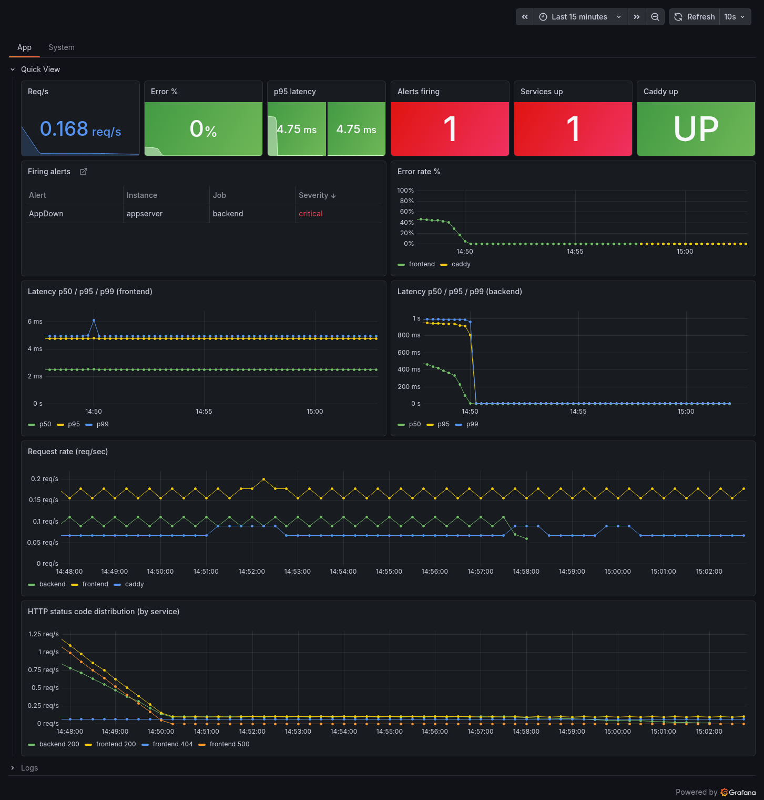
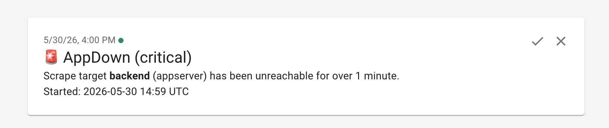
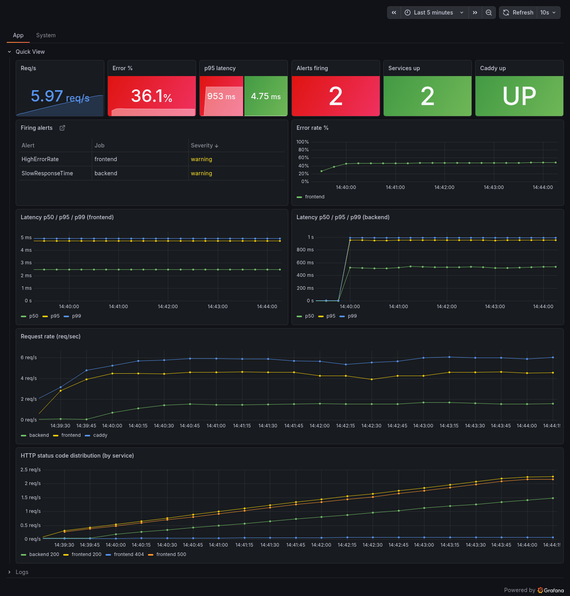
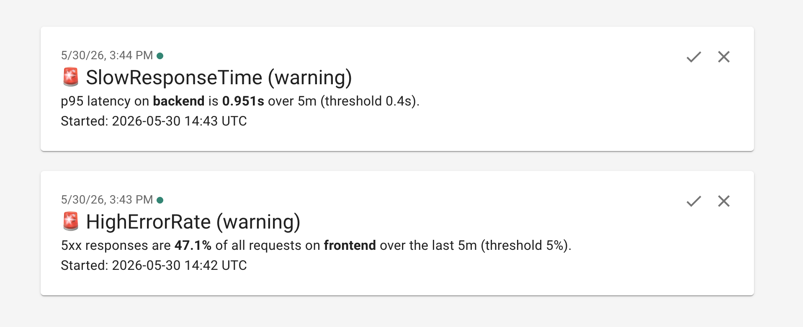
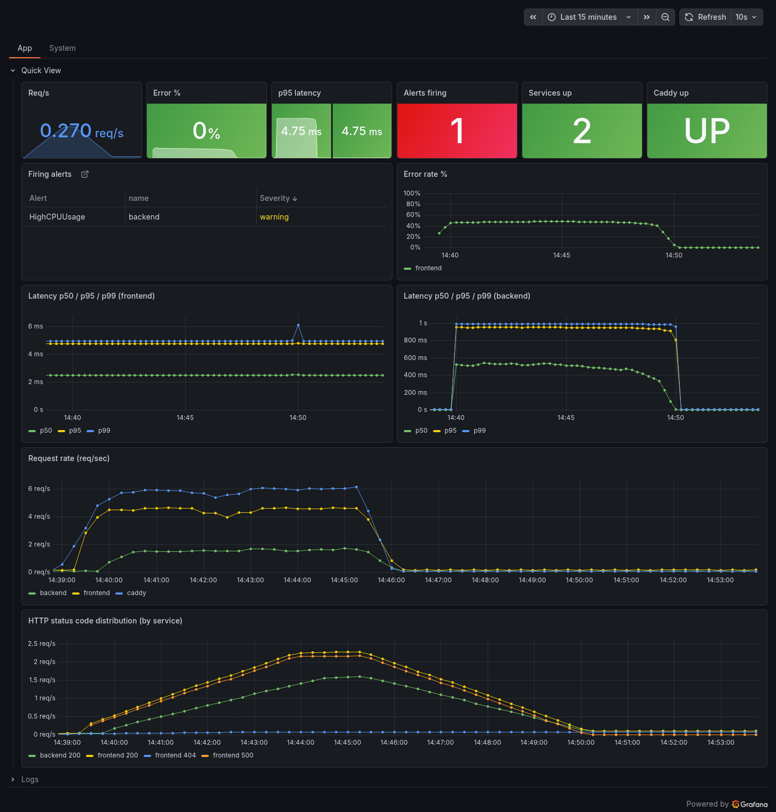
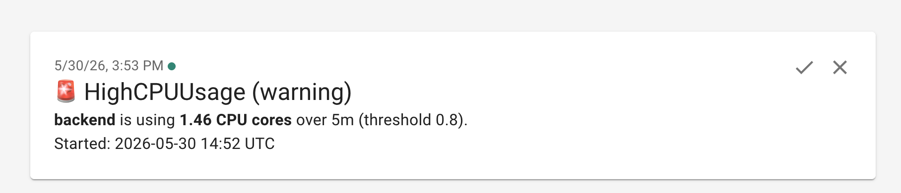
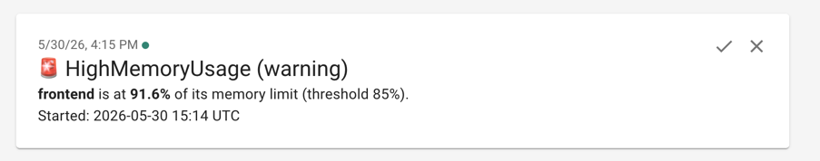

# Alert screenshots

Evidence of each alert firing, shown in Grafana (the Application Performance
dashboard's overview tiles and the Firing alerts table) and as the ntfy
notification it sends. See the project README for how each one is triggered.

## AppDown

Backend container stopped: "Services up" drops to 1 and AppDown fires (critical).

## HighErrorRate and SlowResponseTime

Sustained 5xx load on the frontend and slow responses on the backend: error rate
climbs to ~36%, p95 latency to ~950ms, and both alerts fire (warning), named per
service.

## HighCPUUsage

Backend container burning CPU above the per-container threshold: HighCPUUsage
fires (warning), naming the container.

## HighMemoryUsage

Backend container held above 85% of its memory limit: HighMemoryUsage fires
(warning), naming the container.

